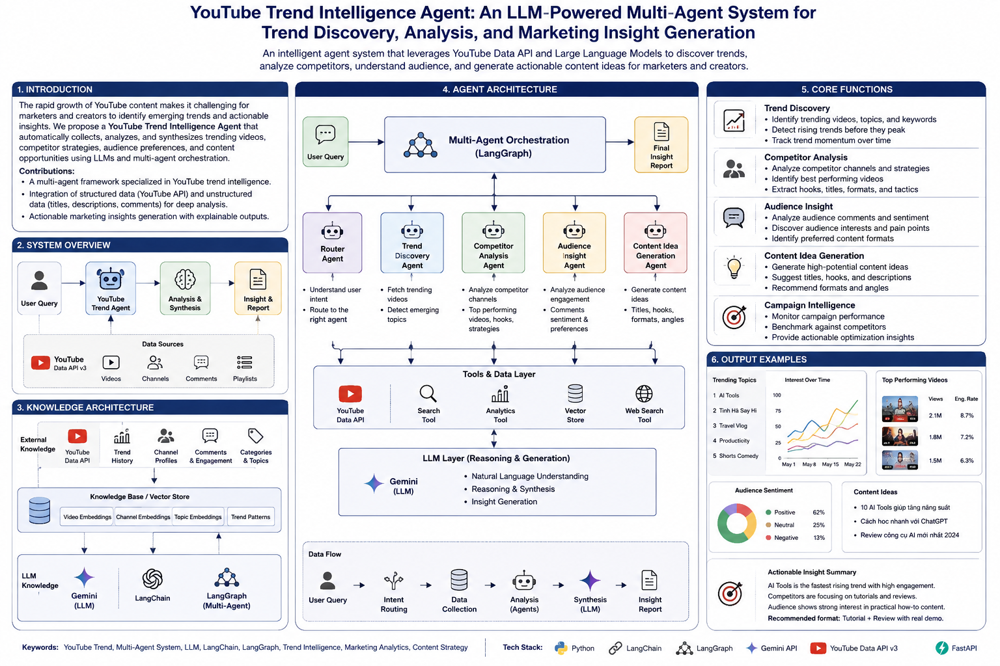

# 🎯 YouTube Trend Intelligence Agent

<p align="center">
  
  
  
  
  
</p>

<p align="center">
  <b>AI-powered YouTube Trend Intelligence for Marketing</b>
</p>

---

## 🚀 Overview

**YouTube Trend Intelligence Agent** analyzes YouTube trends and converts them into actionable marketing insights.

<p align="center">
  
</p>

### 🏗️ Architecture

The system follows a **multi-agent architecture** orchestrated by **LangGraph**:

```text
User Query
    ↓
Router Agent
    ↓
┌──────────────────────────────────────────────┐
│              LangGraph Orchestrator          │
├──────────────────────────────────────────────┤
│                                              │
│  Trend Discovery     → Find trending videos │
│  Competitor Analysis → Analyze channels      │
│  Audience Insight    → Analyze engagement    │
│  Content Generation  → Generate ideas        │
│                                              │
└──────────────────────────────────────────────┘
    ↓
YouTube Data API + Search / Analytics Tools
    ↓
Gemini LLM
    ↓
Analysis & Synthesis
    ↓
Marketing Insights
    ↓
Actionable Recommendations
